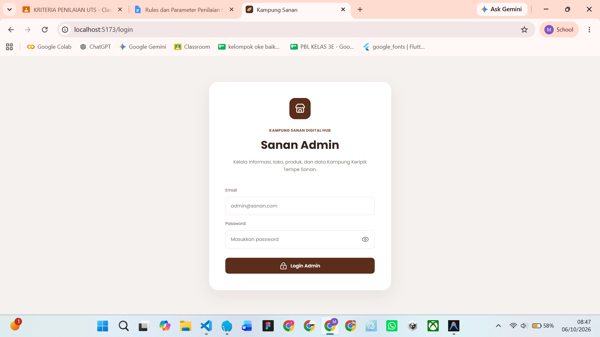
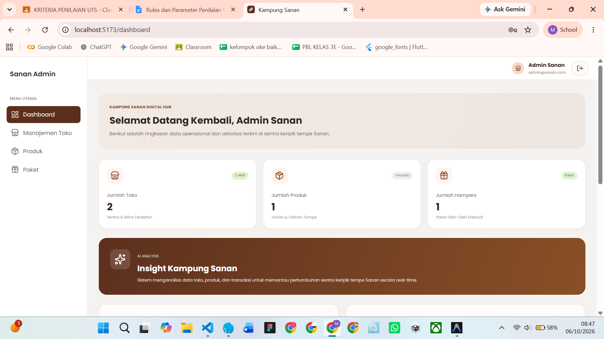
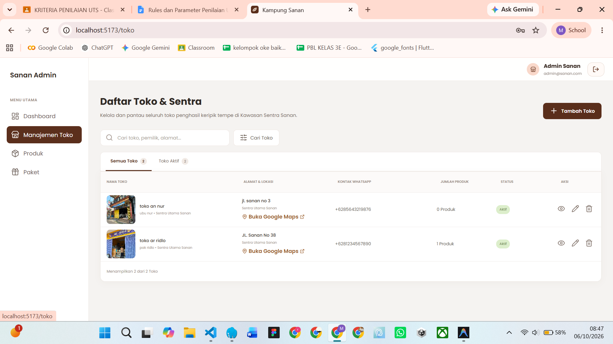

# Sanan Admin — Kampung Keripik Tempe Sanan

Aplikasi web admin untuk mengelola data toko, produk, dan paket hampers Kampung
Keripik Tempe Sanan. Frontend dibuat dengan React dan TypeScript, sedangkan data
diakses melalui REST API backend.

## Fitur

- Login admin dan halaman admin yang dilindungi autentikasi.
- Dashboard ringkasan toko, produk, hampers, serta aktivitas terbaru.
- Manajemen data toko: melihat, mencari, menambah, mengubah, dan menghapus data.
- Manajemen data produk dan paket hampers.
- Form dengan status proses dan pesan kesalahan.
- Navigasi antarhalaman melalui sidebar.

Halaman yang saat ini terdaftar di aplikasi: `/login`, `/dashboard`, `/toko`,
`/produk`, dan `/hampers`.

## Teknologi dan library

### Library utama

| Library | Kegunaan |
|---|---|
| React | Membangun antarmuka berbasis komponen. |
| React DOM | Merender aplikasi React ke halaman web. |
| React Router DOM | Routing dan navigasi antarhalaman. |
| TypeScript | Menambahkan pemeriksaan tipe pada kode. |
| Lucide React | Ikon antarmuka. |
| Axios | Library HTTP yang tersedia sebagai dependency proyek. |

### Perangkat pengembangan

| Library | Kegunaan |
|---|---|
| Vite | Development server dan proses build frontend. |
| ESLint | Pemeriksaan kualitas dan konsistensi kode. |
| TypeScript | Pemeriksaan tipe saat build. |

### Backend dan database

Backend menggunakan Node.js, Express, TypeScript, dan MySQL. Backend juga
menggunakan JWT untuk autentikasi, `bcrypt` untuk hashing password,
`express-validator` untuk validasi, serta `multer` untuk upload gambar.

## Persyaratan

- Node.js 20.19+ atau 22.12+.
- npm.
- MySQL Server yang berjalan secara lokal.
- Backend API berjalan di `http://localhost:5000`.

Frontend saat ini menggunakan alamat API tetap `http://localhost:5000/api`.

## Cara menjalankan proyek

Jalankan backend dan frontend di **dua terminal terpisah**.

### 1. Siapkan database dan backend

Dari root repository:

```bash
cd kripik-tempe-sanan-be
npm install
```

Salin `.env.example` menjadi `.env`, kemudian sesuaikan konfigurasi database
dengan MySQL lokal:

```env
PORT=5000
DB_HOST=localhost
DB_USER=root
DB_PASSWORD=
DB_NAME=sanan_tempe_db
JWT_SECRET=ganti_dengan_secret_lokal
CLIENT_URL=http://localhost:5173
```

Jalankan migrasi dan seed data awal:

```bash
npm run db:migrate
npm run db:seed
```

Kemudian jalankan server backend:

```bash
npm run dev
```

Backend tersedia di `http://localhost:5000`.

### 2. Jalankan frontend

Buka terminal kedua dari root repository:

```bash
cd frontend
npm install
npm run dev
```

Buka alamat yang ditampilkan Vite, biasanya `http://localhost:5173`. Pastikan
backend dan MySQL tetap berjalan saat menggunakan fitur yang mengambil atau
menyimpan data.

### Akun admin

Gunakan akun admin default yang disediakan oleh seeder backend:

- Email: `admin@sanan.com`
- Password: `admin123`

Untuk penggunaan selain pengembangan lokal, ganti kredensial default dan jangan
menggunakan password tersebut di lingkungan produksi.

## Perintah frontend

Jalankan perintah berikut dari folder `frontend`:

```bash
npm run dev      # Menjalankan development server
npm run build    # Memeriksa TypeScript dan membuat build produksi
npm run lint     # Menjalankan ESLint
npm run preview  # Menyajikan hasil build secara lokal
```

## Struktur folder frontend

```text
frontend/
├── public/             # Aset statis
├── src/
│   ├── assets/         # Gambar yang digunakan aplikasi
│   ├── components/     # Komponen bersama, seperti Header dan Sidebar
│   ├── layouts/        # Layout halaman admin
│   ├── pages/          # Halaman login, dashboard, toko, produk, dan hampers
│   ├── services/       # Komunikasi dengan REST API
│   ├── App.tsx         # Routing aplikasi
│   ├── index.css       # Styling aplikasi
│   └── main.tsx        # Entry point React
└── README.md
```

## Screenshot aplikasi

Simpan screenshot hasil aplikasi di folder `screenshots/` pada folder
`frontend/`, lalu pastikan gambar tersebut ikut disertakan saat mengumpulkan
proyek. Ambil screenshot langsung dari aplikasi yang berjalan, bukan dari desain
mockup.

Screenshot belum tersedia di repository saat README ini dibuat. Setelah gambar
diambil, gunakan nama file berikut agar tampil di README:

### Halaman login

Simpan sebagai `frontend/screenshots/login.png`.



### Dashboard admin

Simpan sebagai `frontend/screenshots/dashboard.png`.



### Halaman manajemen data

Simpan sebagai `frontend/screenshots/manajemen-data.png`.



## Catatan

- Pastikan file `.env` backend tidak dibagikan atau dimasukkan ke repository.
- Endpoint API frontend saat ini dikonfigurasi di `src/services/api.ts`.
- Jalankan build dan lint sebelum pengumpulan untuk memeriksa frontend.
